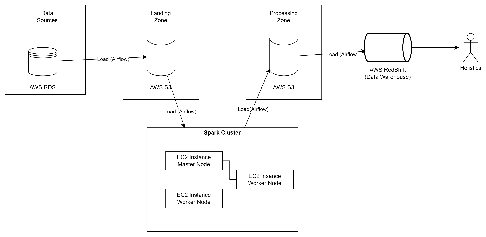
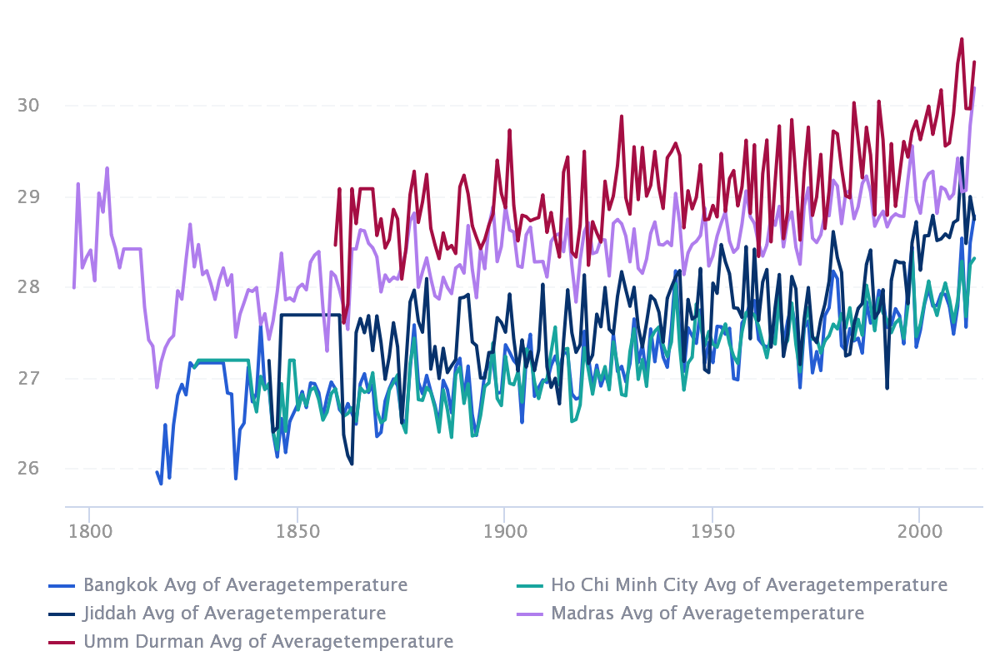

# Data Engineer Project - Climate Project

## **Problem:**

Currently, the climate problem is emerging as a super serious issue affecting every country from developed countries to developing countries.

In this project, I will investigate this problem in terms of global temperature. I want to know:

1. Which are the top/major cities or countries with the highest average temperature over a period (top 5)?
2. Which periods in history had a peak in terms of temperature?
3. What is the global temperature trend?

The above questions are simulated questions of a specific analysis process.

## The architecture for the application:

### Infrastructure Setup

To support our data pipeline, we have created a robust infrastructure using Amazon Web Services (AWS). The infrastructure of the data pipeline consists of:

- Three Amazon Elastic Compute Cloud (EC2) instances:
  - The first instance hosts a Docker container with an Apache Airflow application, which includes a PostgreSQL database for metadata storage, an Airflow scheduler, and an Airflow webserver.
  - The other two instances serve as a master node and a worker node in the Spark Cluster, which is deployed in standalone mode.
- Amazon S3 Bucket:
  - We have set up an S3 bucket to serve as a storage zone for our data pipeline. The Data Zone (Landing Zone) layer of the staging area uses this bucket to store raw data and preprocess data. The Processing Zone layer also uses this bucket to store the processed data from Spark before moving it to the data warehouse.

#### Data Sources
The data sources are CSV files that are initially stored locally. We then transfer these files to three Amazon Relational Database Service (RDS) MySQL databases.

#### Data Warehouse
We create an Amazon Redshift cluster with a single node to store the processed data.

#### BI tools:
We have incorporated BI tools, such as Holistics, to visualize and analyze data. Holistics provides a free plan for 13 days, after which there is a charge to continue using it. Alternatively, users can use any other free BI tools for data visualization.

## Project Initialization and Setup Guide

This guide outlines the necessary steps to initialize and set up the project. This project uses [**Terraform**](https://www.terraform.io/) as an IAC (Infrastrucure-As-Code) platform to automate the process of setting up the infrastructures on AWS.

### Prerequisites

- Github account
- Git installed
- AWS account
- AWS CLI installed and configured
- A development environment (such as Ubuntu or another Linux-based OS) installed on your system. If you are using Windows, please ensure that you have access to a Linux-based terminal such as Git Bash or Windows Subsystem for Linux (WSL).

### Installation

1. Clone the project from Github to your local machine.
2. Use `make init` command to download and install the required packages to initialize the project.
3. Use `make up` command to set up the infrastructure on AWS. Note that this process may take some time, so please be patient.
4. Use `make init-resource` command to populate the RDS databases with raw data to simulate the data sources. Please note that this step requires all RDS databases to be fully created before execution. If you encounter any errors during this step, wait for a few minutes and try again.

### Data Pipeline Operations

Once you have completed the above steps, you can now operate the data pipeline.

1. Access the Airflow website using the public IP or public DNS of the "airflow machine" with port 8081. Alternatively, you can map it to localhost using the command `make cloud-airflow`. The port will now be 8082, and you can access it via localhost:8082.
2. To inspect the Spark cluster, use the URL generated from the combination of the public DNS or public IP of the "master airflow machine" with port 8080. You can also use the command `make cloud-spark` to make it easier. The port will now be 8083.
3. Run your data pipeline.

### Destruction

If you want to destroy the infrastructure, use the `make down` command.

## Data Sources’ schemas:

There are 3 MySQL databases stored in AWS RDS. Those schemas are shown below:

## The Star Schema in the Data Warehouse:

I use AWS Redshift as a data warehouse storing processed data for analytics.

The star schema for the data is shown below:

## Solutions to the problem (Data visualization):

### 1. What are the top/major cities countries having the highest average temperature over the period?

To answer this questions, I will present the line chart of top 5 cities having the highest average temperature over the period

They are respectively Bankok,  Jiddah, Umm Durman, Ho Chi Minh City, and Madras. 

We can clearly see in the chart that, the temperature has tended to increases over the period. 

Similarly, with countries:

.png)

5 countries having the highest average temperature over the period are Aruba, Burkina, Mali, Djibouti, and Senegal. 
Again their temperature have the tendency to increase.

### 2. What are periods in the history being a peak in terms of temperature?

I will limit the scope of the problem down to the temperature on the land since Homo Sapiens is a kind of terrestrial animal right?

As shown in the table, 2013 is the period with the highest average temperature value over the period.

In  a more detail view, this is the chart presenting the detail temperature value of each month in the year 2013:

.png)

### 3. What is the tendency of the temperature globally?

.png)

This is the area chart caring about the “Land and Ocean Average Temperature” and “Land Average Temperature” on the global basis. Both of them show the tendency to increase.
